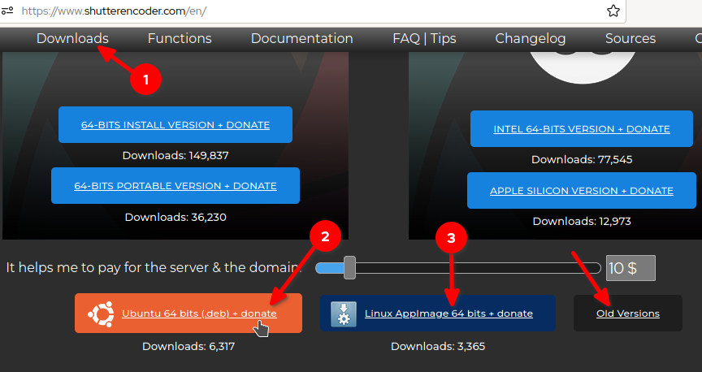

<h1>Shutter Encoder v16.1</h1>


# Shutter-Enconder para Linux de 32 y 64 bits
Shutter Encoder en la página oficial está disponible a esta fecha 2022 para Linux de 64 bits:

[https://www.shutterencoder.com/](https://www.shutterencoder.com/)



Ubuntu de 64 bits  
y como AppImage de 64 bits  

El AppImage no se si funcione también en Sistemas Operativos basados en Debian de 64 bits, pero he descubierto una manera de hacer funcionar Shutter Encoder directamente desde el código fuente ya que es una aplicacion escrita en Java y así también se puede ejecutar en 32 bits (además así tiene menos tamaño pues usaremos las dependencias instaladas desde el Sistema Linux mismo):

**Sistemas Operativos Linux de 32**:  
Shutter Encoder usandolo desde código fuente funciona en Linux de 32 bits como son:

[MX Linux](https://mxlinux.org/)  
[Linux Mint Debian Edition](https://linuxmint.com/download_lmde.php)  
[Escuelas Linux](https://escuelaslinux.sourceforge.io/)  
[AV Linux](https://www.bandshed.net/)   

además debería poderse ejeutar en muchos otros Linux de 32 y 64 bits

**Probado en:**

- MX Linux 21 de 32 bits
- AV Linux MXDE de 32 bits

Si usted es una persona curiosa y quiere saber qué es lo que yo he hecho pues es:

1. Hacer un fork de Shutter Encoder de Paul Pacifico: [https://github.com/paulpacifico/shutter-encoder](https://github.com/paulpacifico/shutter-encoder)  
2. Eliminar la carpeta [Library](https://github.com/paulpacifico/shutter-encoder/tree/master/Library) y en su lugar crear un enlace simbólico hacia /usr/bin para que así utilicemos el Java de los repositorios de Linux junto con ffmpeg y las demás dependencias que si ustedes descomprimen el [deb de Shutter](https://www.shutterencoder.com/old%20versions/) (que ya ha sido compilado) verán que en la carpeta Library que está en "*/usr/lib/Shutter Encoder/usr/bin/Library/*" están todas las aplicaciones que el programa usa pero esas son sólo para 64 bits, pero la gran mayoría de ellas se las puede usar desde los repositorios de Linux y es eso lo que he hecho, entonces instálelas:

## Dependencias para MX Linux 21

```
sudo apt-get install default-jre git p7zip-full \
     yt-dlp ffmpeg libimage-exiftool-perl \
     mkvtoolnix dvdauthor mediainfo
```

De esto lo más importante es que con ffmpeg se pueden convertir videos a varios formatos, y audios también, y con mediainfo se puede ver la información de ellos *(con clic derecho en el archivo multimedia y clic en Informaciones...)*

La dependencia:

yt-dlp  

sirve para descargar videos de youtube u otro sitio (no es del todo necesaria)

está en los repositorios de MX Linux 21: [http://mxrepo.com/mx/repo/pool/main/y/](http://mxrepo.com/mx/repo/pool/main/y/)

La dependencia siguiente *(si no la necesita no es necesario instalarla)*:

tsmuxer  

sirve para crear archivos TS y M2TS para la transmisión IP y para otras cosas, [ver](https://www.google.com/search?q=tsmuxer%27para+que+sirve&client=firefox-b-e&sxsrf=ALiCzsbvsMN5gaxQW9DsOX5VFKAiI1wZxQ:1659321123430&ei=IzvnYt3zGZD_wbkP0sOoqAI&start=10&sa=N&ved=2ahUKEwidkYXxzKT5AhWQfzABHdIhCiUQ8NMDegQIARBK&biw=1247&bih=577&dpr=1.09).
  
está en los repositorios de deb-multimedia.org que puede ver las instrucciones de instalación en:

**Instalar repositorio deb-multimedia.org en MX Linux 19, 21, antiX 19, 21 para instalar ejem: Avidemux, MP4Joiner, MP4Splitter, mp4tools**  
[https://facilitarelsoftwarelibre.blogspot.com/2020/07/como-instalar-el-repisitorio-de.html](https://facilitarelsoftwarelibre.blogspot.com/2020/07/como-instalar-el-repisitorio-de.html)

además allí también está:

yt-dlp    
  
 si añaden el respositorio de deb-multimedia.org de uno de los dos se instalará el más actual.

## Dependencias para MX Linux 19

```
sudo apt-get install default-jre git p7zip-full \
     ffmpeg libimage-exiftool-perl \
     mkvtoolnix dvdauthor mediainfo
```
Si alguien lo usa a MX 19 y añade los repositorios de deb-multimedia es posible que de allí pueda instalar:

tsmuxer  
yt-dlp 

si es que los necesiten

## Dependencias para Ubuntu 22.04

```
sudo apt-get install default-jre git p7zip-full \
     dcraw yt-dlp ffmpeg libimage-exiftool-perl \
     mkvtoolnix dvdauthor mediainfo
```

en 22.04 viene:

yt-dlp  

[https://packages.ubuntu.com/yt-dlp](https://packages.ubuntu.com/yt-dlp)

## Dependencias para Ubuntu 18.04, 20.04

```
sudo apt-get install default-jre git p7zip-full \
     dcraw ffmpeg libimage-exiftool-perl \
     mkvtoolnix dvdauthor mediainfo
```

Puede que de algún ppa puedan encontrar :

tsmuxer  
yt-dlp 

deben buscar.


## Instalación
Les cuento que estoy haciendo funcionar algunas aplicaciones en Linux de 32 bits e igual esta sirve también para 64 bits y las estoy instalando en una carpeta llamada:

AppLinux

les pido que la creen y no la borren, pues para tener todas las aplicaciones allí:


ahora sí ponga una terminal allí :

```
git clone https://github.com/wachin/shutter-encoder-Linux
cd shutter-encoder-Linux
./set_icon_and_java_launcher.sh
cp Shutter-Encoder.desktop $HOME/.local/share/applications/
echo "Dios les bendiga"
```

**Explicacion.-** Si se pregunta sobre la tercer linea, es un script que preparé para corregir el nombre de usuario, pues si no está bien escrito no funcionará el lanzador .desktop que la cuarta línea instalará ni tampoco se vería su icono (si desean luego pueden revisar su contenido con clic derecho y luego abriendolo con algún editor de texto).

aquí una imagen:


después de instalado búsquelo entre sus aplicaciones:

shutter


y se abrirá

En la siguiente imagen Shutter Encoder abierto, dar clic en Explorar o arrastrar los archivos allí para cargarlos:


# Sobre las dependencias del programa

El autor de este programa [Paul Pacífico](https://twitter.com/paulpacifico) lo diseñó para trabajar en algunas operaciones con las siguientes dependencias:

7za: www.7-zip.org  
dcraw: [http://www.dechifro.org/dcraw/](http://www.dechifro.org/dcraw/)  
yt-dlp: [https://github.com/yt-dlp/yt-dlp](https://github.com/yt-dlp/yt-dlp)  
ffmpeg: [http://ffmpeg.org/](http://ffmpeg.org/)  
exiftool: [https://exiftool.org/](https://exiftool.org/)  
tsMuxeR: [https://github.com/justdan96/tsMuxer](https://github.com/justdan96/tsMuxer)  
mkvmerge: [https://mkvtoolnix.download/](https://mkvtoolnix.download/)  
mediainfo: [https://mediaarea.net/fr/MediaInfo](https://mediaarea.net/fr/MediaInfo)  
dvdauthor: [http://dvdauthor.sourceforge.net/](http://dvdauthor.sourceforge.net/)  
WeTransfer: [https://developers.wetransfer.com/](https://developers.wetransfer.com/)    
XpdfReader: [http://www.xpdfreader.com/](http://www.xpdfreader.com/)   
bmxtranswrap: [sourceforge.net/p/bmxlib/home/Home](sourceforge.net/p/bmxlib/home/Home)  

pero:

**WeTransfer:** [https://developers.wetransfer.com/](https://developers.wetransfer.com/)  

No sé cómo se pueda instalar pues entré en el sitio y no encuentro, pero creo que lo mejor es usarlo online:

[https://wetransfer.com/](https://wetransfer.com/)  

con eso nos olvidamos de esa aplicación.

**bmxtranswrap:** [sourceforge.net/p/bmxlib/home/Home](sourceforge.net/p/bmxlib/home/Home)  

esta aplicacioń por el monento estoy investigando para qué sirve.

**XpdfReader:** [http://www.xpdfreader.com/](http://www.xpdfreader.com/)     
Sobre este programa investigando en la versión de Shutter Encoder deb de 64 bits que se la puede descargar de:

[https://www.shutterencoder.com/old%20versions/Linux/](https://www.shutterencoder.com/old%20versions/Linux/)


y descomprimiendola con clic derecho:


 y entrando en la carpeta y buscando la carpeta "**Library**":


encuentro que están dos archivos:

pdfinfo  
pdftoppm  

esos dos son de XpdfReader la herramienta de línea de comandos que puede constalarlas entrando a:

[http://www.xpdfreader.com/download.html](http://www.xpdfreader.com/download.html)


a esta fecha 2022-07-31 descargué la versión:

xpdf-tools-linux-4.04.tar.gz

aparece la carpeta y entrando en ejemplo la carpeta de 32 bits:


y tiene en MB:

pdfinfo    1,6 MB  
pdftoppm   4,2 MB  

vemos están esos ejecutables, los cuales son los mismos que están en MX Linux 21 instalados por defecto por el archivo:

poppler-utils

que viendolo en Synaptic:


con más exactitud viendo en

/usr/bin

los tamaños que tienen son:


pdftoppm  29,4 KB  
pdfinfo   49,5 KB  

Si usted quisiera los podría sobreescribir con los de XpdfReader y no pasaría nada, funcionarían. Aquella operación se la podría llevar a cabo con por ejemplo el administrador de archivos pcmanfm abriendolo como super administrador:

sudo pcmanfm

 y copiando los archivos de XpdfReader y copiandolos en /usr/bin y sobreescribiendo los que ya están, pero sino nomás podemos seguir con los que están instalados en el sistema operativo.


# Ejemplos de uso de Shutter Encoder

## Conversión de Video a mp3
He cargado un video mp4 y lo voy a convertir en mp3

Le recomiendo saber primero qué calidad tiene el audio del video, como ya instalamos mediainfo lo usaremos para saber esa información, de clic derecho en el video que haya cargado y clic en informaciones, ejemplo:


allí aparecerá la información:


como sé que es:

192 kbps no le puedo poner más de este valor

ahora voy a elegir la función:

MP3

así:


aparecerá una ventana más, por defecto aparecerá en la calidad del audio:

320

pongale en vez del valor por defecto el valor que tiene su mp3, en este caso:


clic en iniciar funcion:


ahora a esperar un poco, eso dependerá de la duración del video y tendrá su mp3

cuando aparezca completado al 100%:


# Manual de uso de Shutter Encoder
Está en inglés:

**Shutter Encoder - Documentation**  
[https://www.shutterencoder.com/documentation.html](https://www.shutterencoder.com/documentation.html)


# Consultas

Desktop Launcher to a Java App?  
[https://forums.linuxmint.com/viewtopic.php?t=238109](https://forums.linuxmint.com/viewtopic.php?t=238109)  
