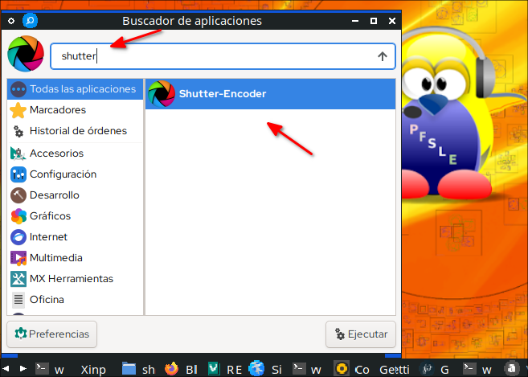

<h1>Shutter Encoder v16.1</h1>

[https://www.shutterencoder.com/](https://www.shutterencoder.com/)


# Shutter-Enconder para Linux de 32 y 64 bits

Para Sistemas Operativos Linux de 32:  

[MX Linux](https://mxlinux.org/)  
[Linux Mint Debian Edition](https://linuxmint.com/download_lmde.php)  
[Escuelas Linux](https://escuelaslinux.sourceforge.io/)  
[AV Linux](https://www.bandshed.net/)   

y muchos otros Linux de sólo 64 bits

**Probado en:**

- MX Linux 21 de 32 bits
- AV Linux MXDE de 32 bits

## Dependencias para MX Linux 21

```
sudo apt-get install default-jre git p7zip-full \
     dcraw yt-dlp ffmpeg libimage-exiftool-perl \
     tsmuxer mkvtoolnix dvdauthor mediainfo
```

## Dependencias para Ubuntu 22.04

```
sudo apt-get install default-jre git p7zip-full \
     dcraw yt-dlp ffmpeg libimage-exiftool-perl \
     mkvtoolnix dvdauthor mediainfo
```

# Sobre las dependencias del programa

El autor de este programa [Paul Pacífico](https://twitter.com/paulpacifico) lo diseñó para trabajar con las siguientes dependencias:

7za: www.7-zip.org  
dcraw: [http://www.dechifro.org/dcraw/](http://www.dechifro.org/dcraw/)  
yt-dlp: [https://github.com/yt-dlp/yt-dlp](https://github.com/yt-dlp/yt-dlp)  
ffmpeg: [http://ffmpeg.org/](http://ffmpeg.org/)  
exiftool: [https://exiftool.org/](https://exiftool.org/)  
tsMuxeR: [https://github.com/justdan96/tsMuxer](https://github.com/justdan96/tsMuxer)  
mkvmerge: [https://mkvtoolnix.download/](https://mkvtoolnix.download/)  
mediainfo: [https://mediaarea.net/fr/MediaInfo](https://mediaarea.net/fr/MediaInfo)  
dvdauthor: [http://dvdauthor.sourceforge.net/](http://dvdauthor.sourceforge.net/)  
WeTransfer: [https://developers.wetransfer.com/](https://developers.wetransfer.com/)    
XpdfReader: [http://www.xpdfreader.com/](http://www.xpdfreader.com/)   
bmxtranswrap: [sourceforge.net/p/bmxlib/home/Home](sourceforge.net/p/bmxlib/home/Home)  

De esas están disponibles la mayoría en los repositorios de MX Linux 21, pero:

**WeTransfer:** [https://developers.wetransfer.com/](https://developers.wetransfer.com/)  

No sé cómo se pueda instalar pues entré en el sitio y no encuentro, pero creo que lo mejor es usarlo online:

[https://wetransfer.com/](https://wetransfer.com/)  

con eso nos olvidamos de esa aplicación.

**bmxtranswrap:** [sourceforge.net/p/bmxlib/home/Home](sourceforge.net/p/bmxlib/home/Home)  

esta por el monento estoy investigandola.

**XpdfReader:** [http://www.xpdfreader.com/](http://www.xpdfreader.com/)     
Sobre este programa investigando en la versión de Shutter Encoder deb de 64 bits que se la puede descargar de:

[https://www.shutterencoder.com/old%20versions/Linux/](https://www.shutterencoder.com/old%20versions/Linux/)


y descomprimiendola con clic derecho:


 y entrando en la carpeta y buscando la carpeta "**Library**":


encuentro que están dos archivos:

pdfinfo  
pdftoppm  

esos dos son de XpdfReader la herramienta de línea de comandos que puede constalarlas entrando a:

[http://www.xpdfreader.com/download.html](http://www.xpdfreader.com/download.html)


a esta fecha 2022-07-31 descargué la versión:

xpdf-tools-linux-4.04.tar.gz

aparece la carpeta y entrando en ejemplo la carpeta de 32 bits:


y tiene en MB:

pdfinfo    1,6 MB  
pdftoppm   4,2 MB  

vemos están esos ejecutables, los cuales son los mismos que están en MX Linux 21 instalados por defecto por el archivo:

poppler-utils

que viendolo en Synaptic:


con más exactitud viendo en

/usr/bin

los tamaños que tienen son:


pdftoppm  29,4 KB  
pdfinfo   49,5 KB  

Si usted quisiera los podría sobreescribir con los de XpdfReader y no pasaría nada, funcionarían. Aquella operación se la podría llevar a cabo con por ejemplo el administrador de archivos pcmanfm abriendolo como super administrador:

sudo pcmanfm

 y copiando los archivos de XpdfReader y copiandolos en /usr/bin y sobreescribiendo los que ya están, pero sino nomás podemos seguir con los que están instalados en el sistema operativo.


## Instalación
Les cuento que estoy haciendo funcionar algunas aplicaciones en Linux de 32 bits e igual esta sirve también para 64 bits y las estoy instalando en una carpeta llamada:

AppLinux

le pido por favor que la cree y no la borre, pues para tener todas estas aplicaciones allí:


ahora sí ponga una terminal allí :

```
git clone https://github.com/wachin/shutter-encoder-Linux
cd shutter-encoder-Linux
./set_icon_and_java_launcher.sh
cp Shutter-Encoder.desktop $HOME/.local/share/applications/
echo "Dios les bendiga"
```


después de instalado búsquelo entre sus aplicaciones:

shutter



y se abrirá

Shutter Encoder abierto, dar clic en Explorar o arrastrar los archivos allí para cargarlos:


# Ejemplos de uso

## Conversión de Video a mp3
He cargado un video mp4 y lo voy a convertir en mp3

Le recomiendo saber primero qué calidad tiene el audio del video, como ya instalamos mediainfo lo usaremos para saber esa información, de clic derecho en el video que haya cargado y clic en informaciones, ejemplo:


allí aparecerá la información:


como sé que es:

192 kbps no le puedo poner más de este valor

ahora voy a elegir la función:

MP3

así:


aparecerá una ventana más, por defecto aparecerá en la calidad del audio:

320

pongale en vez del valor por defecto el valor que tiene su mp3, en este caso:


clic en iniciar funcion:


ahora a esperar un poco, eso dependerá de la duración del video y tendrá su mp3

cuando aparezca completado al 100%:


# Manual de uso de Shutter Encoder
Está en inglés:

**Shutter Encoder - Documentation**  
[https://www.shutterencoder.com/documentation.html](https://www.shutterencoder.com/documentation.html)


# Consultas

Desktop Launcher to a Java App?  
[https://forums.linuxmint.com/viewtopic.php?t=238109](https://forums.linuxmint.com/viewtopic.php?t=238109)  
